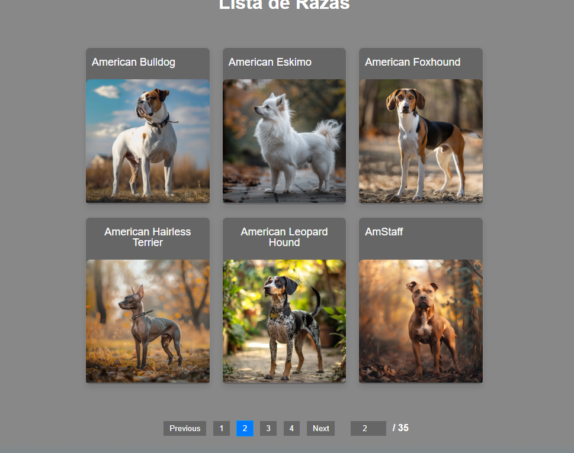
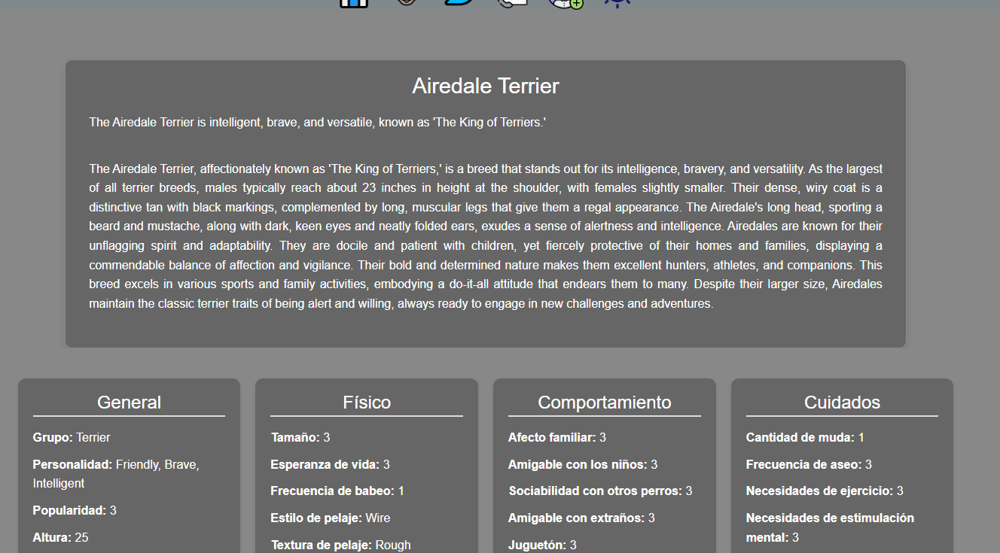

# **Integración de la API en el Sitio Web**

La API [Dog Registry](https://registry.dog/api/v1) permite a mi aplicacion acceder a informacion sobre razas de perros
en tiempo
real, suministradas por una comunidad de usuarios que actualizan la API usando un repositorio libre en GitHub.

## 1. **Conexión a la API**

He usado el endpoint de la API (`https://registry.dog/api/v1`) para acceder a los datos disponibles.

https://github.com/rekznoz/lawebdelperro/blob/39c308b7c7e70e28241fffd284351a908fbc9083/src/config/GetRazas.jsx#L1-L23

## 2. **Procesamiento de Datos**

Una vez recibida la respuesta de la API en formato JSON, se procesaron los datos dentro de mi aplicación. he usado la
``fetch API`` para realizar solicitudes a la API y recuperar los datos necesarios. para darle estilo al mostrarlos.

https://github.com/rekznoz/lawebdelperro/blob/39c308b7c7e70e28241fffd284351a908fbc9083/src/pages/Raza.jsx#L35-L134

## 3. **Diseño de la Interfaz**

La integración no solo consistió en realizar solicitudes a la API, sino también en diseñar una experiencia de usuario
adecuada. Los datos recuperados se muestran en secciones como:

- **Lista de razas:** Un catálogo interactivo generado dinámicamente desde los datos proporcionados por la API.

https://github.com/rekznoz/lawebdelperro/blob/main/src/components/Bloque.jsx

- **Paginaciones:** Para mostrar los registros de perros de forma ordenada y eficiente.

https://github.com/rekznoz/lawebdelperro/blob/main/src/components/Galeria.jsx

- **Detalles de cada raza:** Información detallada sobre cada raza, incluyendo características, fotos y otros datos
  relevantes.

## 4. **Gestión de Errores**

Implementé un sistema de manejo de errores para capturar posibles problemas como fallos de conexión, respuestas
incorrectas o límites de uso de la API. Esto incluye mensajes de error claros para los usuarios y logs detallados para
los administradores.

- **Errores en las páginas de la web:** Se muestra un mensaje de error en caso de que la página solicitada no exista.

- **Errores en la API:** Se muestra un mensaje de error en caso de que la API no responda correctamente.

## 5. **Protección de Rutas**

Para proteger las rutas de mi aplicación, he implementado un sistema de autenticación basado en la ID del usuario.

https://github.com/rekznoz/lawebdelperro/blob/39c308b7c7e70e28241fffd284351a908fbc9083/src/layouts/PrivadoFavoritos.jsx#L5-L16

