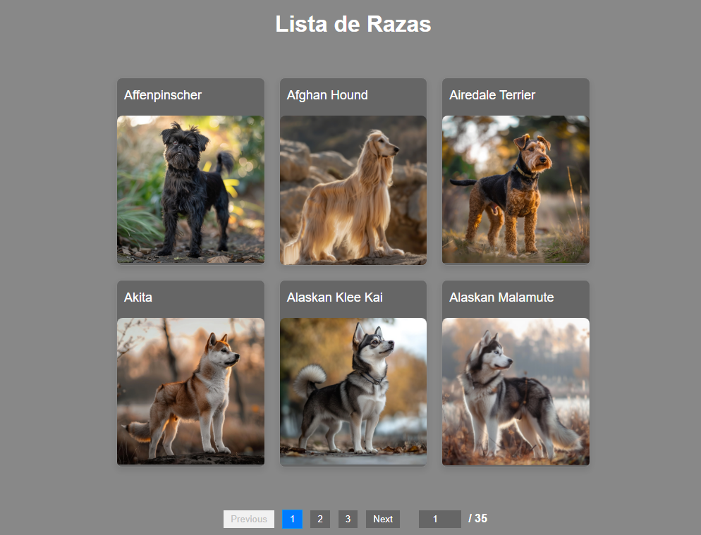
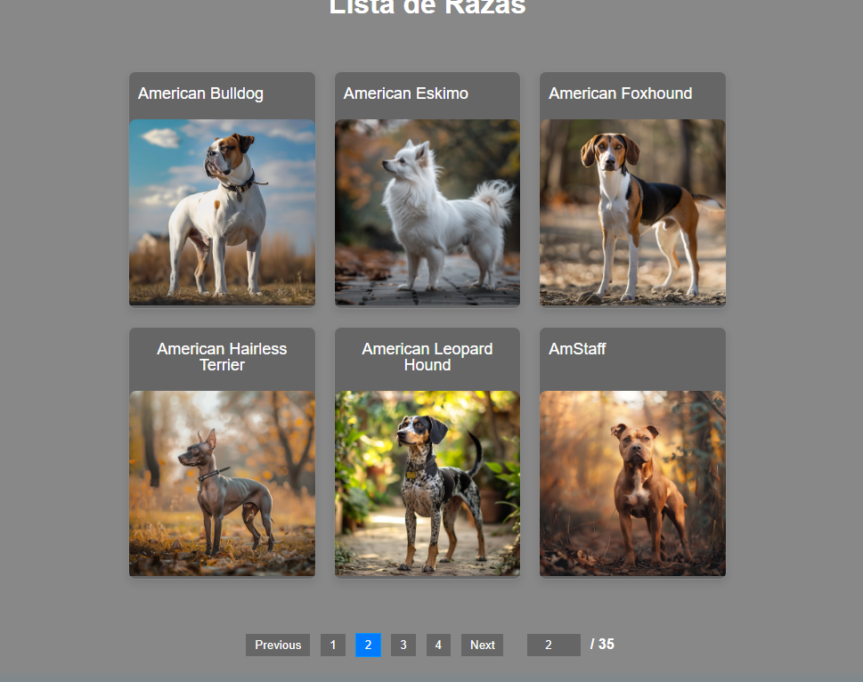
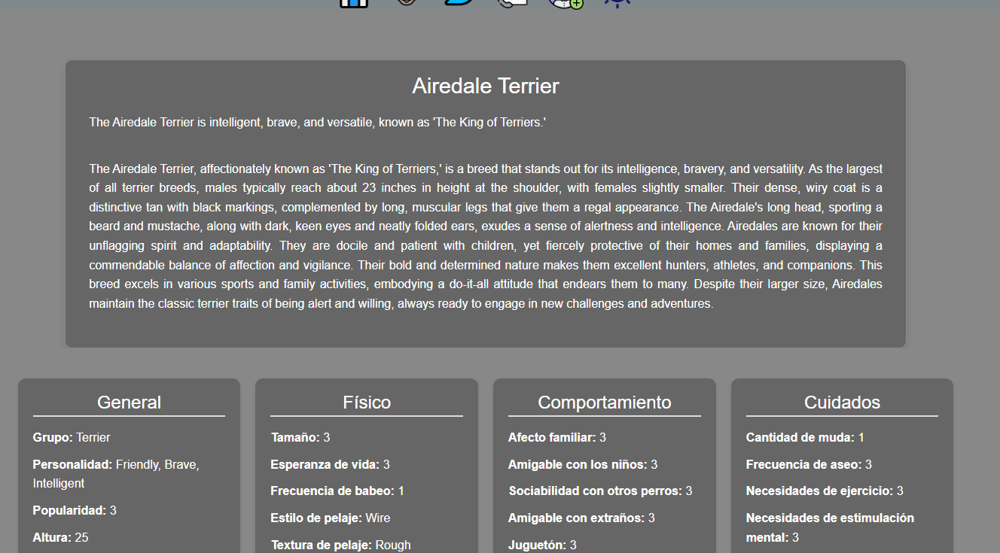

------

### **🌐 Integración de la API en el Sitio Web de Razas de Perros 🐶**

La API [Dog Registry](https://registry.dog/api/v1) permite que nuestra aplicación acceda en tiempo real a información sobre razas de perros, enriquecida por la colaboración de una comunidad de usuarios. A continuación, se describen los pasos clave para integrar esta API de manera efectiva.

---

## **1️⃣ Conexión a la API 🔗**

Para interactuar con la API, utilizamos el endpoint principal: `https://registry.dog/api/v1`.

Hemos implementado solicitudes usando la función `fetch` para obtener datos dinámicos desde la API.

https://github.com/rekznoz/lawebdelperro/blob/39c308b7c7e70e28241fffd284351a908fbc9083/src/config/GetRazas.jsx#L1-L23

---

## **2️⃣ Procesamiento de Datos 📊**

Los datos en formato JSON recuperados de la API se procesan dentro de nuestra aplicación para presentarlos en una
interfaz atractiva.
https://github.com/rekznoz/lawebdelperro/blob/39c308b7c7e70e28241fffd284351a908fbc9083/src/pages/Raza.jsx#L35-L134

---

## **3️⃣ Diseño de la Interfaz 💻**

### **🐾 Lista de Razas**

Una lista interactiva generada dinámicamente desde los datos proporcionados por la API. Los usuarios pueden buscar y
navegar por razas específicas.

https://github.com/rekznoz/lawebdelperro/blob/39c308b7c7e70e28241fffd284351a908fbc9083/src/components/Bloque.jsx#L8-L58
---

### **📚 Paginaciones**

Para manejar eficientemente un gran volumen de datos, se han implementado paginaciones que organizan los registros de
manera ordenada y visualmente atractiva.

https://github.com/rekznoz/lawebdelperro/blob/39c308b7c7e70e28241fffd284351a908fbc9083/src/components/Galeria.jsx#L4-L58

---

### **📋 Detalles de Cada Raza**

Proporcionamos información detallada de cada raza, incluyendo:

- 🐕 Descripción de características.
- 📷 Imágenes de alta calidad.
- 📊 Datos específicos sobre tamaño, temperamento, entre otros.

---

## **4️⃣ Gestión de Errores 🚨**

Para garantizar una experiencia fluida, se implementaron sistemas de manejo de errores que notifican a los usuarios y
registran problemas para los administradores.

### **❌ Errores en Páginas No Encontradas**

Se muestra un mensaje claro al usuario si intenta acceder a una página inexistente:

### **⚠️ Errores en la API**

Si ocurre un problema con la conexión a la API, se despliega un mensaje amigable con la opción de intentar nuevamente.

---

## **5️⃣ Protección de Rutas 🔒**

Las rutas sensibles de la aplicación están protegidas mediante un sistema de autenticación basado en la ID del usuario.
Esto asegura que las secciones privadas, como **favoritos**, sean accesibles solo para usuarios registrados.

https://github.com/rekznoz/lawebdelperro/blob/39c308b7c7e70e28241fffd284351a908fbc9083/src/layouts/PrivadoFavoritos.jsx#L5-L16

---
